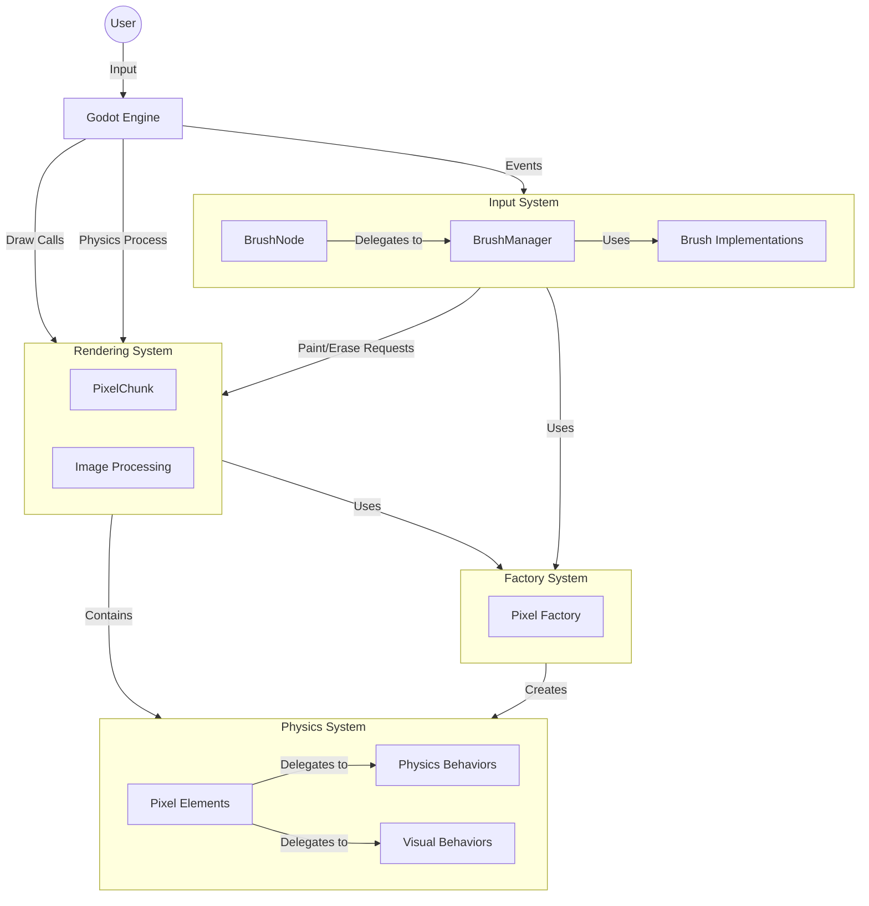

# DiggingDwarfs Architecture Overview

This document provides a comprehensive view of the DiggingDwarfs project architecture, combining insights from the various UML diagrams.

## System Component Diagram

## Architectural Patterns

### Composition over Inheritance

The DiggingDwarfs project employs a composition-based architecture rather than an inheritance-based one. This is particularly evident in the physics system:

- **PixelElement** is a concrete class that contains behavior components
- **IPixelBehaviour** and **IVisualBehavior** interfaces define the behaviors
- Concrete behavior implementations (e.g., SolidBehaviour, LiquidBehaviour) provide specific functionality
- PixelFactory creates pixels by combining appropriate behaviors

### Factory Pattern

The PixelFactory implements the factory pattern to create different types of pixels:

- CreateAir()
- CreateSolid()
- CreateLiquid()
- CreateStructure()

Each factory method combines the appropriate behaviors to create a specific type of pixel.

### Event-Driven Communication

Components communicate through events to maintain loose coupling:

- BrushNode emits events (PaintRequested, EraseRequested, BrushChanged)
- PixelChunk subscribes to these events
- This enables the input system to communicate with the rendering system without tight coupling

### Parallel Processing

The physics simulation uses parallel processing to improve performance:

- RefreshFrame processes pixels in parallel
- Concurrent data structures (ConcurrentBag) are used to handle thread-safe operations
- Conflict resolution in ProcessSwaps handles race conditions

## System Breakdown

### Physics System

[Detailed Class Diagram](ClassDiagram-Physics.md)

The physics system handles the behavior and state of individual pixels:

- **PixelElement**: The core class representing a pixel
- **PixelBehaviour**: Defines how pixels move and interact
- **VisualBehavior**: Defines how pixels appear

### Rendering System

[Detailed Class Diagram](ClassDiagram-RenderingInput.md)

The rendering system handles visualization and manages the pixel grid:

- **PixelChunk**: The main rendering component that manages the pixel grid
- **Image Processing**: Handles drawing pixels to the screen

### Input System

[Detailed Class Diagram](ClassDiagram-RenderingInput.md)

The input system handles user interaction:

- **BrushNode**: Processes user input and integrates with Godot
- **BrushManager**: Manages brush settings and selection
- **Brush Implementations**: Different brush shapes (Circle, Square)

### Factory System

The factory system creates and configures pixel objects:

- **PixelFactory**: Creates different types of pixels with appropriate behaviors

## Interaction Flows

### Pixel Update Flow

[Detailed Sequence Diagram](SequenceDiagram-PixelUpdate.md)

This flow illustrates how pixels are updated during the physics process:

1. Godot engine calls _PhysicsProcess on PixelChunk
2. Each pixel's position is updated based on its behavior
3. Swaps are processed and conflicts resolved
4. The visual representation is updated

### User Interaction Flow

[Detailed Sequence Diagram](SequenceDiagram-UserInteraction.md)

This flow illustrates how user input leads to pixel modification:

1. User input is captured by Godot and passed to BrushNode
2. BrushNode processes input and determines affected positions
3. BrushNode triggers events to modify pixels
4. PixelChunk updates the affected pixels

## Architecture Benefits

1. **Flexibility**: Easy to create new pixel types by mixing behaviors
2. **Maintainability**: Clear separation of concerns, independently testable components
3. **Extensibility**: New behaviors can be added without modifying existing code
4. **Scalability**: Modular architecture supports large-scale development

## Future Considerations

As mentioned in the Architecture.md document, several areas are marked for future development:

1. Game-specific systems (Player, World, UI)
2. Advanced simulation features
3. Performance optimizations
4. Additional tool systems
5. Comprehensive test suite

These will build upon the existing architecture, leveraging its modular and extensible design.