# Physics System Class Diagram

```mermaid
classDiagram
    %% Core Classes
    class PixelElement {
        +PixelType Type
        +Color BaseColor
        +Color Color
        +PhysicsStatistics Statistics
        +PhysicsEnforcers Enforcers
        +IPixelBehaviour Behaviour
        +IVisualBehavior VisualBehavior
        +IsEmpty(PixelElement) bool
        +GetSwapPosition(Vector2I, PixelChunk) (Vector2I, Vector2I)
        +SetRandomColor()
        +Clone() PixelElement
        +CheckSurroundingPixels(Vector2I, PixelChunk, PixelAction)
        +FindNextPixelPosition(Vector2I, List~Vector2I~, PixelChunk, Vector2I, int) (Vector2I, Vector2I)
    }

    class PhysicsStatistics {
        +float Mass
        +float Momentum
        +float Friction
        +bool IsFalling
        +bool CancelVerticalMotion
        +bool CancelHorizontalMotion
    }

    class PhysicsEnforcers {
        +bool DisableGravity
        +bool IsStatic
        +bool EnableDirectionalBias
        +Vector2 DirectionalBias
    }

    %% Enums
    class PixelType {
        <<enumeration>>
        Empty
        Solid
        Liquid
        Gas
    }

    %% Interfaces
    class IPixelBehaviour {
        <<interface>>
        +UpdatePhysics(PixelElement)
        +GetSwapPosition(Vector2I, PixelChunk, PixelElement) (Vector2I, Vector2I)
        +ShouldFall(PixelElement) bool
        +InitializePhysics(PixelElement)
    }

    class IVisualBehavior {
        <<interface>>
        +GetBaseColor() Color
        +SetRandomColor(PixelElement)
        +GetCurrentColor(PixelElement) Color
        +UpdateVisualState(PixelElement)
    }

    %% Concrete Behaviors
    class EmptyBehaviour {
        +UpdatePhysics(PixelElement)
        +GetSwapPosition(Vector2I, PixelChunk, PixelElement) (Vector2I, Vector2I)
        +ShouldFall(PixelElement) bool
        +InitializePhysics(PixelElement)
    }

    class SolidBehaviour {
        +UpdatePhysics(PixelElement)
        +GetSwapPosition(Vector2I, PixelChunk, PixelElement) (Vector2I, Vector2I)
        +ShouldFall(PixelElement) bool
        +InitializePhysics(PixelElement)
    }

    class LiquidBehaviour {
        +UpdatePhysics(PixelElement)
        +GetSwapPosition(Vector2I, PixelChunk, PixelElement) (Vector2I, Vector2I)
        +ShouldFall(PixelElement) bool
        +InitializePhysics(PixelElement)
    }

    class StructureBehaviour {
        +UpdatePhysics(PixelElement)
        +GetSwapPosition(Vector2I, PixelChunk, PixelElement) (Vector2I, Vector2I)
        +ShouldFall(PixelElement) bool
        +InitializePhysics(PixelElement)
    }

    %% Visual Behaviors
    class AirVisualBehavior {
        +GetBaseColor() Color
        +SetRandomColor(PixelElement)
        +GetCurrentColor(PixelElement) Color
        +UpdateVisualState(PixelElement)
    }

    class SolidVisualBehavior {
        +GetBaseColor() Color
        +SetRandomColor(PixelElement)
        +GetCurrentColor(PixelElement) Color
        +UpdateVisualState(PixelElement)
    }

    class LiquidVisualBehavior {
        +GetBaseColor() Color
        +SetRandomColor(PixelElement)
        +GetCurrentColor(PixelElement) Color
        +UpdateVisualState(PixelElement)
    }

    %% Factory
    class PixelFactory {
        <<static>>
        +CreateAir() PixelElement
        +CreateSolid() PixelElement
        +CreateLiquid() PixelElement
        +CreateStructure() PixelElement
    }

    %% Relationships
    PixelElement --> PixelType : has
    PixelElement --> PhysicsStatistics : has
    PixelElement --> PhysicsEnforcers : has
    PixelElement --> IPixelBehaviour : has
    PixelElement --> IVisualBehavior : has
    
    EmptyBehaviour ..|> IPixelBehaviour : implements
    SolidBehaviour ..|> IPixelBehaviour : implements
    LiquidBehaviour ..|> IPixelBehaviour : implements
    StructureBehaviour ..|> IPixelBehaviour : implements
    
    AirVisualBehavior ..|> IVisualBehavior : implements
    SolidVisualBehavior ..|> IVisualBehavior : implements
    LiquidVisualBehavior ..|> IVisualBehavior : implements
    
    PixelFactory ..> PixelElement : creates
    PixelFactory ..> EmptyBehaviour : uses
    PixelFactory ..> SolidBehaviour : uses
    PixelFactory ..> LiquidBehaviour : uses
    PixelFactory ..> StructureBehaviour : uses
    PixelFactory ..> AirVisualBehavior : uses
    PixelFactory ..> SolidVisualBehavior : uses
    PixelFactory ..> LiquidVisualBehavior : uses
```

This diagram shows the composition-based architecture of the physics system. The `PixelElement` class is the core entity that uses behavior components (via `IPixelBehaviour` and `IVisualBehavior` interfaces) instead of inheritance. The `PixelFactory` creates different pixel types by combining appropriate behaviors.