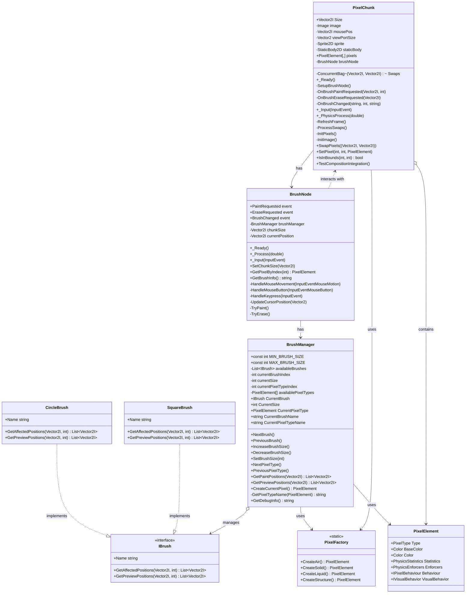

# Rendering and Input Systems Class Diagram

This diagram illustrates the rendering and input systems of the DiggingDwarfs project. The `PixelChunk` class is the central rendering component that manages the pixel grid and handles physics updates. The brush system consists of the `IBrush` interface with `CircleBrush` and `SquareBrush` implementations, managed by the `BrushManager`. The `BrushNode` serves as the integration point with the Godot engine, handling user input and delegating to the brush manager.