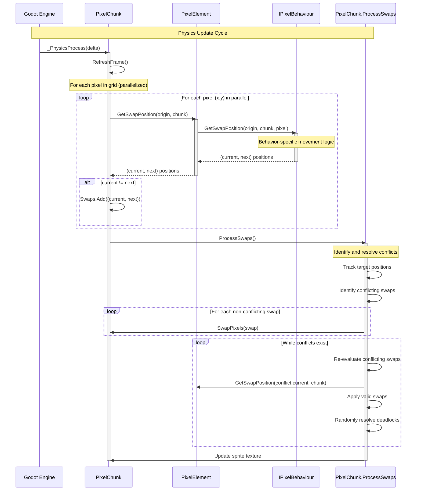

# Pixel Update Flow Sequence Diagram

This sequence diagram illustrates the physics update flow in the DiggingDwarfs project:

1. The Godot engine calls `_PhysicsProcess` on the `PixelChunk` every physics frame
2. `PixelChunk` calls `RefreshFrame` to update all pixels
3. For each pixel in the grid (in parallel):
   - The pixel's `GetSwapPosition` method is called
   - This delegates to the pixel's behavior component via the `IPixelBehaviour` interface
   - The behavior determines where the pixel should move to
   - If movement is needed, the swap is added to a collection
4. After all potential moves are calculated, `ProcessSwaps` handles the actual movement:
   - It identifies which swaps would conflict (multiple pixels trying to move to the same position)
   - It applies non-conflicting swaps immediately
   - For conflicting swaps, it recalculates and tries to resolve them
   - It handles potential deadlocks by randomly resolving some conflicts
5. Finally, it updates the sprite texture to reflect the new pixel states

This demonstrates how the composition-based architecture enables different movement behaviors while maintaining a unified update mechanism.