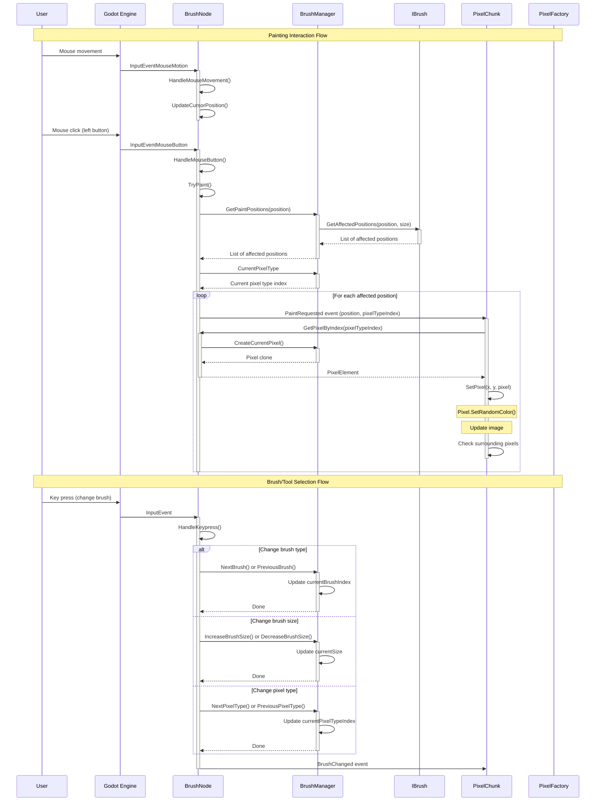

# User Interaction Flow Sequence Diagram

This sequence diagram illustrates the user interaction flow in the DiggingDwarfs project:

1. **Painting Interaction**:
   - User moves the mouse and clicks to paint
   - Input events are captured by the Godot engine and passed to BrushNode
   - BrushNode uses BrushManager to determine affected positions
   - For each position, a PaintRequested event is triggered
   - PixelChunk creates and places the appropriate pixel

2. **Brush/Tool Selection**:
   - User presses keys to change brush properties
   - BrushNode handles these inputs and updates BrushManager
   - BrushManager updates its internal state (brush type, size, pixel type)
   - BrushNode emits a BrushChanged event to notify observers

This demonstrates how the input system is integrated with the rendering system, using events to communicate between components while maintaining separation of concerns.